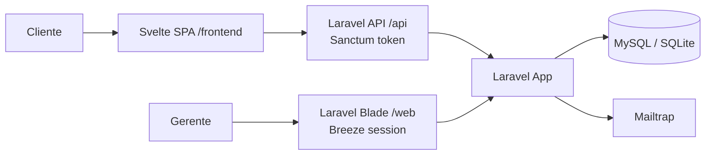
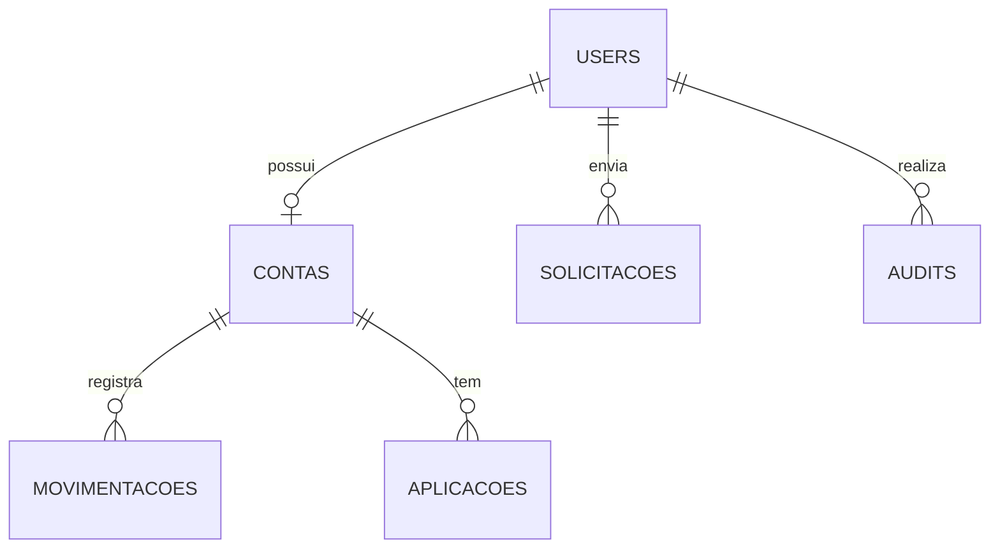

# GILbank

Sistema bancário simulado com Laravel monolítico e frontend cliente em Svelte 5.

## Visão geral

- Backend em Laravel 13 com Blade, Breeze e Sanctum.
- Frontend SPA em /frontend com Vite + Svelte 5.
- Autorização por papéis: gerente geral, gerente de conta e cliente.
- Auditoria com Laravel Auditing e Mailtrap para credenciais.

## Arquitetura



## Instalação

1. Copie .env.example para .env.
2. Configure banco e Mailtrap.
3. Rode:

```bash
composer install
npm install
php artisan key:generate
php artisan migrate:fresh --seed
```

4. Inicie o backend:

```bash
php artisan serve
```

5. Inicie o frontend:

```bash
cd frontend
npm install
npm run dev
```

## Credenciais de teste

- Gerente geral: geral@gilbank.local / password
- Gerente de conta: maria.gerente@gilbank.local / password
- Gerente de conta: joao.gerente@gilbank.local / password
- Cliente: ana.cliente@gilbank.local / password
- Cliente: bruno.cliente@gilbank.local / password
- Cliente: carla.cliente@gilbank.local / password
- Cliente: diego.cliente@gilbank.local / password
- Cliente: elisa.cliente@gilbank.local / password

## Modelagem principal



## Observações

- A rota raiz redireciona usuários autenticados para o dashboard.
- A API é exclusiva para clientes; gerentes usam sessão web.
- O diretório bootstrap/cache precisa ser gravável no ambiente local.

## Licença

MIT
